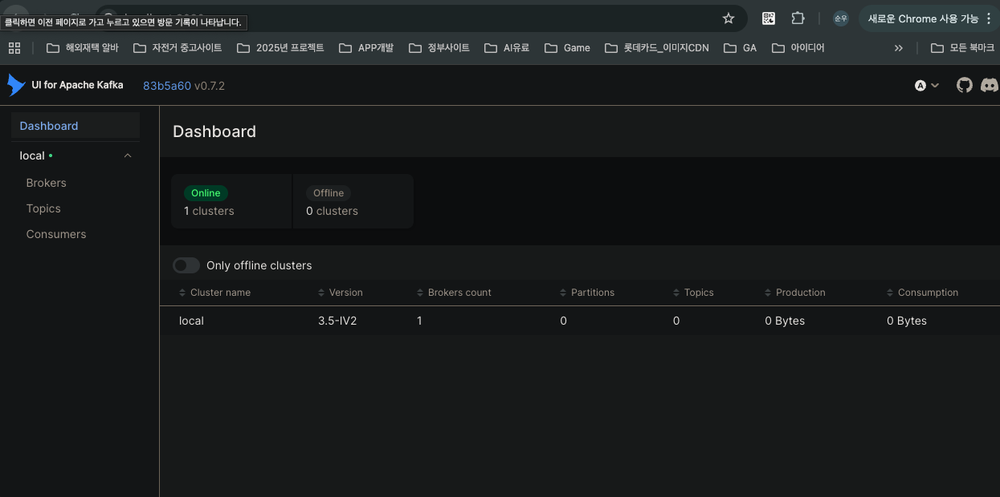

# KAFKA 실행 
## 3건의 컨테이너
```text
1. zookeeper (포트 2181)
   └─ Kafka의 메타데이터 관리자

2. kafka (포트 9092)
   └─ 실제 메시지 브로커
   └─ Spring Boot에서 localhost:9092로 접속

3. kafka-ui (포트 8080)
   └─ 웹 브라우저로 Kafka 모니터링
   └─ Topic, Message 확인 가능
```

## docker desktop 실행 확인
 프로세스 기동확인 터미널에서 체크 
> docker ps
```shell
milk@milkui-Macmini kafka % docker ps
CONTAINER ID   IMAGE                             COMMAND                   CREATED              STATUS                    PORTS                                                                                      NAMES
20b0d20feb56   provectuslabs/kafka-ui:latest     "/bin/sh -c 'java --…"   About a minute ago   Up 59 seconds             0.0.0.0:8080->8080/tcp, :::8080->8080/tcp                                                  kafka-ui
15fb80245c2f   confluentinc/cp-kafka:7.5.0       "/etc/confluent/dock…"   About a minute ago   Up 59 seconds (healthy)   0.0.0.0:9092->9092/tcp, :::9092->9092/tcp, 0.0.0.0:29092->29092/tcp, :::29092->29092/tcp   kafka
b0b435cef7e0   confluentinc/cp-zookeeper:7.5.0   "/etc/confluent/dock…"   About a minute ago   Up About a minute         0.0.0.0:2181->2181/tcp, :::2181->2181/tcp                                                  zookeeper
6f4cab6b52be   n8nio/n8n                         "tini -- /docker-ent…"   6 weeks ago          Up 3 minutes              0.0.0.0:5678->5678/tcp, :::5678->5678/tcp                                                  n8n-docker-n8n-1
milk@milkui-Macmini kafka %
```

## docker 프로세스 검증 이후 docker-compose kafka 실행
```text
cd boilerplate-gradle/kafka #해당 폴더 이동
docker-compose.yml 파일 확인
```
>docker-compose up -d

## 실행 확인
>docker-compose ps
```text
milk@milkui-Macmini kafka % docker-compose ps
WARN[0000] /Users/milk/workspace/boilerplate-gradle/kafka/docker-compose.yml: the attribute `version` is obsolete, it will be ignored, please remove it to avoid potential confusion
NAME        IMAGE                             COMMAND                   SERVICE     CREATED         STATUS                   PORTS
kafka       confluentinc/cp-kafka:7.5.0       "/etc/confluent/dock…"   kafka       4 minutes ago   Up 4 minutes (healthy)   0.0.0.0:9092->9092/tcp, :::9092->9092/tcp, 0.0.0.0:29092->29092/tcp, :::29092->29092/tcp
kafka-ui    provectuslabs/kafka-ui:latest     "/bin/sh -c 'java --…"   kafka-ui    4 minutes ago   Up 4 minutes             0.0.0.0:8080->8080/tcp, :::8080->8080/tcp
zookeeper   confluentinc/cp-zookeeper:7.5.0   "/etc/confluent/dock…"   zookeeper   4 minutes ago   Up 4 minutes             0.0.0.0:2181->2181/tcp, :::2181->2181/tcp
```
## Kafka UI 접속확인
http://localhost:8080

